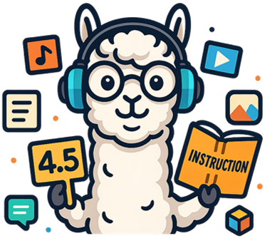

#   Omni-Reward: Towards Generalist Omni-Modal Reward Modeling with Free-Form Preferences

  <a href="https://huggingface.co/datasets/HongbangYuan/OmniRewardBench"> 🤗 Benchmark</a></a> |
  <a href="https://hf.co/datasets/jinzhuoran/OmniRewardData"> 🤗 Dataset</a> | 
  <a href="https://hf.co/jinzhuoran/OmniRewardModel"> 🤗 Model</a> | 
  <a href="https://github.com/HongbangYuan/OmniReward"> 🏠 Homepage (Coming Soon!)</a>

Reward models (RMs) play a critical role in aligning AI behaviors with human preferences.
We propose **Omni-Reward**, a step toward generalist omni-modal reward modeling with support for free-form
preferences, consisting of:

+ 📈 **Evaluation**: We introduce <a href="https://huggingface.co/datasets/HongbangYuan/OmniRewardBench"> OmniRewardBench</a></a>, the 
first omni-modal reward benchmark with free-form preferences, covering nine tasks 
across five modalities including text, image, video, audio, and 3D.

+ 📚 **Data**: We 
construct <a href="https://hf.co/datasets/jinzhuoran/OmniRewardData"> OmniRewardData</a> , a multimodal preference dataset comprising 248K 
general preference pairs and 69K instruction-tuning pairs for training generalist 
omni-modal RMs.

+ 🧠 **Model**: We propose <a href="https://hf.co/jinzhuoran/OmniRewardModel"> OmniRewardModel</a>, which includes 
both discriminative and generative RMs, and achieves strong performance on 
Omni-RewardBench as well as other widely used RM benchmark.

# QuickStart

# Training

# Evaluation

